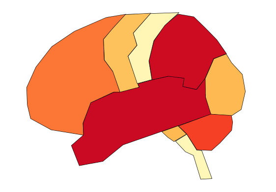

## colorBrain
`colorBrain` is a proof of concept to demonstrate how data can be expressed pictorially using GIS (Geographic Information Systems) methods.

## Concept
Represent data by color-coding regions of a complex image, for example a brain.  In this case the brain image was inspired by http://www.highlands.edu/academics/divisions/scipe/biology/faculty/harnden/2121/images/brainlandmarks.jpg and sketched with polygons using [qgis](http://www.qgis.org/).  Once saved as a shapefile, it can be colored in R using the `maptools` package.

